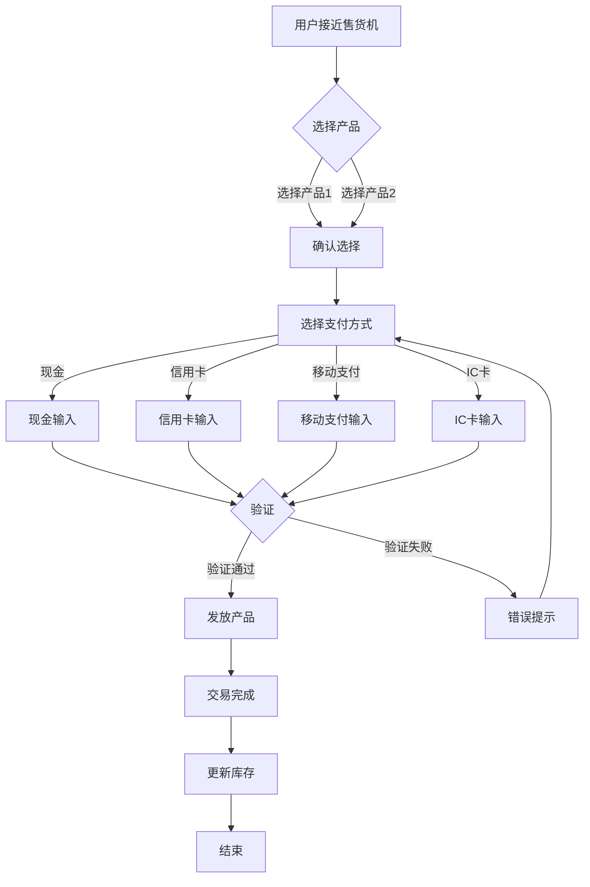

# Vending Machine System Flowchart

## Introduction
该文档详细描述了自动售货机的系统流程，包括用户操作到交易完成的整个过程，采用Mermaid格式的流程图，以及各个阶段的详细中文说明。

## Flowchart

## Detailed Step-by-Step Explanations
1. **产品选择**: 用户接近售货机并选择想要购买的产品。
2. **支付处理**: 用户选择支付方式并输入相应的支付信息。
3. **验证**: 系统验证支付信息的有效性。
4. **产品发放**: 验证通过后，系统发放所选产品。

## Multiple Payment Methods Support
- **现金**: 用户可以使用现金进行支付。
- **信用卡**: 支持使用信用卡支付。
- **移动支付**: 包括支付宝、微信支付等移动支付方式。
- **IC卡**: 使用IC卡进行交易。

## Error Handling Scenarios
- **支付失败**: 如果支付验证失败，系统将提示错误并重新要求输入支付信息。
- **产品缺货**: 如果所选产品缺货，系统将提示用户并允许用户重新选择。

## Inventory Management Features
系统会自动更新库存，确保用户只能选择可用产品。

## System Architecture Explanation
系统采用分层架构，包括用户界面层、业务逻辑层和数据存储层，确保系统的灵活性和可维护性。